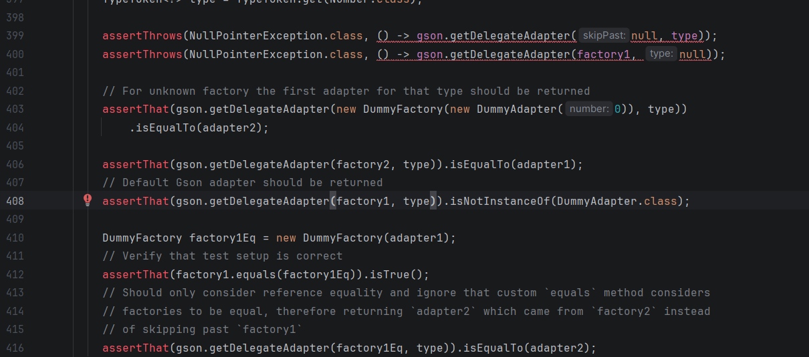
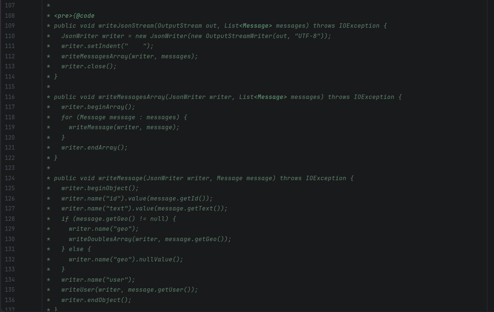
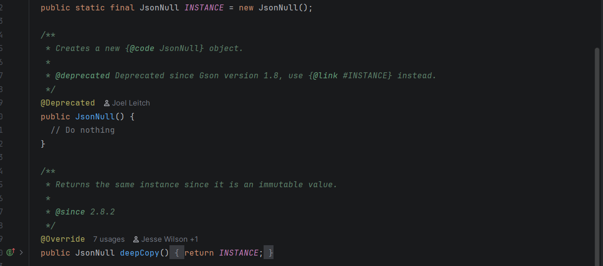
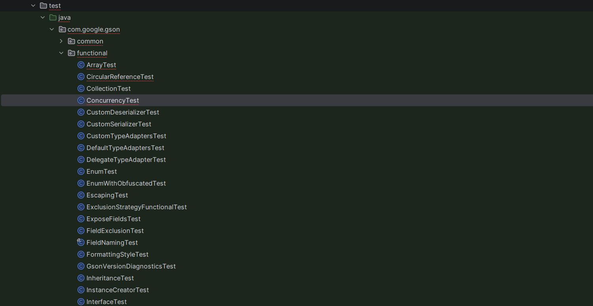

# Présentation et utilité du projet GSON
## Périmètre de l’analyse
Le projet Gson est structuré en plusieurs modules :

gson

extras

metrics

proto

test-shrinker

test-graal-native-image

test-jpms

Cependant, en raison de la taille du projet et du temps imparti, l’analyse approfondie s’est principalement concentrée sur le module principal :
 `gson/src/main/java/com.google.gson`

Ce module contient le cœur fonctionnel de la bibliothèque (sérialisation et désérialisation JSON) et représente la majorité du code ainsi que la majorité des tests (environ 98 %).

Les autres modules ont été analysés de manière plus globale (tests, duplication, structure).

## Présentation
Gson est une bibliothèque Java développée par Google qui permet de convertir des objets Java en JSON et inversement.
Plus explicitement,elle sert à:

- **transformer des objets Java en texte JSON (sérialisation)**.

- **reconstruire des objets Java à partir du JSON (désérialisation)**.

### Les fonctionnalités principales
Les principales fonctionnalités de Gson sont :
- Conversion automatique d’objets Java en JSON

- Conversion d’une chaîne JSON en objet Java 

- Support des types génériques Java (List, Map, classes génériques)

- Possibilité de personnaliser la représentation JSON des objets

- Support d’objets complexes avec héritage et structures imbriquées

### Comment lancer / utiliser le projet
Gson n'est pas une application éxécutable mais une bibliothèque Java.Du coup pour l'utiliser ,il faut l'ajouter comme dépendance dans un projet Java.
Ensuite on pourra utiliser l'API dans le code java 
### Résultat du projet
Le projet ne produit pas un programme  ou un fichier éxécutable.
Le projet produit :
soit une chaîne JSON
soit un objet Java

Il ne génère pas de programme autonome.

## Description du projet
Lors de l’audit du projet Gson, nous avons cherché un fichier README décrivant le projet, son installation et son utilisation.  
Cependant celui-ci ne décrit pas en détail l’architecture interne ni les choix de conception pour comprendre le projet en profondeur.

La principale source d’information disponible est une documentation partielle décrivant l’objectif général de la bibliothèque, mais sans fournir de détails sur l’architecture interne ou la structure du code.

### Historique du logiciel 
#### Analyse du git 
Lors de l’analyse du dépôt GitHub,nous avons vu que ce projet dispose de trois contributeurs.
Le projet est actuellement en mode maintenance,il est d'ailleurs toujours actif .
Le dépôt contient environ dix branches. La branche principale main est active et contient les versions officielles du projet.  
Les autres branches sont anciennes (plusieurs années) et ne semblent plus utilisée
Environ 97 Pull Requests ont été identifiées.  
Certaines Pull Requests sont acceptées (merge), ce qui est indiqué par un statut vert, tandis que d’autres sont refusées ou fermées sans intégration, indiquées par un statut rouge ou sans statut.

## Analyse approfondie

### Tests
On va s'interesser aux tests 
Le projet contient bien un dossier dédié aux tests (src/test).
Plusieurs classes de tests sont présentes, ce qui montre une volonté de validation du code.
Dans ce projet, on retrouve principalement des tests unitaires.
**Données quantitatives** 
Au total, le projet comporte :

4619 tests unitaires
0 erreur
0 échec
19 tests ignorés (skipped)
L’absence d’erreurs et d’échecs indique une bonne stabilité des tests existants.

#### Repartition des tests par module**
- Gson (JSON)	4536 test unitaires soit un ratio de 4536/113​=40.14 environ 40 test par classe

- Extra	40 test unitaires soit un ratio de 40/14 = 2.85 environ 3 test par classe

- Proto	12 test unitaires soit un ratio de 12/3 = 4 environ 4 test par classe

Les modules Test-Graal-Native et Test-JPMS contiennent respectivement 10 et 12 test unitaires Cependant, ils ne contiennent pas de classes Java dans src/main.

- le module test-shrinker contient 33 classes, mais aucun test associé n’a été identifié, ce qui constitue un point faible en termes de couverture et de validation.

#### Répartition des classes
- Le projet contient 185 classes principales, réparties comme suit :
113 dans le module Gson
14 dans extras
22 dans metric
3 dans proto
33 dans test-shrinker

Le ratio moyen global est :
    4619/185 =25 tests par classe

Cependant On constate que près de 98 % des tests sont concentrés dans le module Gson (JSON).
Les autres modules présentent un nombre très faible de tests, ce qui suggère un déséquilibre dans la stratégie de validation.

#### Structuration des tests

**Organisation**

Bien que le projet comporte un nombre très important de tests, leur organisation structurelle présente certaines limites.

Dans le module gson, le dossier src/main est structuré en plusieurs sous-packages (com.google.gson, reflect, stream, etc.), contenant des classes concrètes, des interfaces, des classes abstraites et des annotations.

Cependant, l’organisation du dossier src/test ne reflète pas fidèlement cette architecture.

Les sous-dossiers de test ne correspondent pas clairement aux sous-packages du code source.
Il est donc difficile d’identifier précisément :

quelle classe est testée,
dans quel module logique elle appartient,
et si toutes les classes possèdent un test associé.

#### Classes non testées

Aucune classe de test correspondante n’a été identifiée pour les classes présentes dans ``metrics/src/main/`

#### Nombre d’assertions dans certaines méthodes

On observe que certaines méthodes de test contiennent plusieurs assertions.
En théorie, un test devrait vérifier un comportement précis.
Un test = un comportement vérifié
C'est le cas de la classe test/com.google.gson/GsonTest

#### Présence de classes non destinées aux tests dans src/test

On remarque que dans le dossier src/test, certaines classes ont été créées et ne correspondent pas à des classes de test.
 EXemple dans test/com.google.gson/GsonTypeAdapterTest et test/com.google.gson/GsonTest On y retrouve des classes et et des methodes qui ne sont pas des tests
Et de la classe primitiveTypeAdapter qui se trouve dans le package test/com.google.gson/

Cela peut poser plusieurs problèmes :

Confusion dans la structure du projet
Difficulté à distinguer code de production et code de test
En principe, le dossier src/test devrait contenir uniquement :
des classes de test
éventuellement des classes utilitaires dédiées aux tests (mocks...)

### Commentaires
Le projet comporte 13 986 lignes de code pour 5 119 lignes de commentaires, soit un taux global de 36,6 %.

Dans le module principal (gson), on observe 11 198 lignes de code et 4 545 lignes de commentaires, soit un taux d’environ 40,5 %.

Ce taux est relativement élevé. Cependant, une analyse qualitative montre que ces commentaires ne sont pas exclusivement des commentaires explicatifs.

On distingue :
- Des commentaires Javadoc documentant les méthodes et paramètres.

- Des commentaires de licence et de copyright en en-tête des fichiers.
    Dans les classes du package gson/com.google.gson/internal/bind 

- Des lignes de code commentées (code désactivé).
 Par exemple dans : gson/src/main/java/com.google.gson/Gson.java 
 On y observe des blocs de code commentés qui réduisent la lisibilité.

 

**Petite conclusion**
Bien que le taux de commentaires soit élevé quantitativement, une partie significative ne contribue pas directement à la documentation fonctionnelle du projet.
Les commentaires de licence augmentent artificiellement le taux global sans améliorer la compréhension fonctionnelle du code.Pareil pour les codes commenté .Ce n'est pas recommandé.

### Duplication 
On va s’intéresser ici au code dupliqué.Dans ce projet nous avons au total 358 lignes dupliquées

119 extra (8.7%) 
145 gson (0.7%)
94 metrics (9.4%)

On observe que le module Gson possède le plus grand nombre de lignes dupliquées en valeur absolue.
Cependant, son pourcentage de duplication reste très faible (0,7 %) en raison de la taille importante du module.

À l’inverse, les modules Extra et Metrics présentent un pourcentage plus élevé, ce qui indique une duplication proportionnellement plus importante.

**Analyse de la duplication**
L’analyse montre que certaines duplications correspondent aux en-têtes de licence Apache présents dans chaque fichier source. Elles ne constituent pas un problème de conception.

Concernant le code métier, certaines structures similaires apparaissent dans la classe TypeAdapters, notamment dans les méthodes read() et write() des différents TypeAdapter. Ces blocs présentent des ressemblances structurelles (gestion du JsonToken.NULL, gestion des exceptions).
Les modules Extra et Metrics présentent un taux proportionnellement plus élevé (8,7 % et 9,4 %)
Un taux de duplication élevé (42 %) a été détecté dans :
`extras/src/main/java/com.google.gson/typeadapters/UtcDateTypeAdapter.java`

### Code déprécié
L’analyse SonarQube indique la présence d’éléments dépréciés dans le projet sous la notation `@deprecated`

Un élément déprécié correspond à une méthode ou une classe marquée comme obsolète, généralement parce qu’une alternative plus récente ou plus performante existe.

**Les éléments dépréciés**
La méthode `setLenient()` est marquée comme dépréciée dans com.google.gson/stream/JsonReader.java . elle n'est pas appelé par d'autres méthodes (aucune utilisation)
Meme chose pour:

com.google.gson/stream/JsonWriter.java methode `setLenient` @deprecated aucune utilisation
com.google.gson/Gson.java methode `excluder` @deprecated aucune utilisation
com.google.gson/JsonParser 4 méthodes deprecated   aucune utilisation

## Nettoyage de Code et Code smells

### Règle de nommage
L’analyse des règles de nommage du projet montre globalement un respect des bonnes pratiques recommandées en génie logiciel.
#### Nommage des classes

Les classes du module principal présentent des noms :
descriptifs
explicites
cohérents avec leur responsabilité

#### Nommage des méthodes et attributs

Les méthodes analysées possèdent des noms :
verbaux et explicites (fromJson, toJson, deepCopy, etc.)
conformes aux conventions Java (camelCase)
cohérents avec leur comportement

Les attributs observés sont également explicites et ne génèrent pas d’ambiguïté.
 
#### nommage des classes de test
Cependant, une légère incohérence est observée concernant les classes de test.

En principe, une classe de test reprend le nom exact de la classe testée en ajoutant le suffixe Test.

Exemple recommandé :  Gson.java -> GsonTest.java     , sonReader.java -> JsonReaderTest.java
Or, dans le projet, certaines classes présentes dans :
gson/src/test/java/

ne correspondent pas directement à une classe unique du dossier :
gson/src/main/java/
C'est le cas des classes de test suivant:

- ne correspondent pas strictement à une seule classe,

- portent des noms moins directement traçables.

### Nombre magique 
L'analyse des classes ne montre pas de nombre magique .

Parmis les classes contenant des valeurs numériques on a la classe `gson/src/main/java/com.google.gson/stream/JsonReader` dont les nombres sont encapsulés dans des constantes static final avec des noms explicites donc pas magique